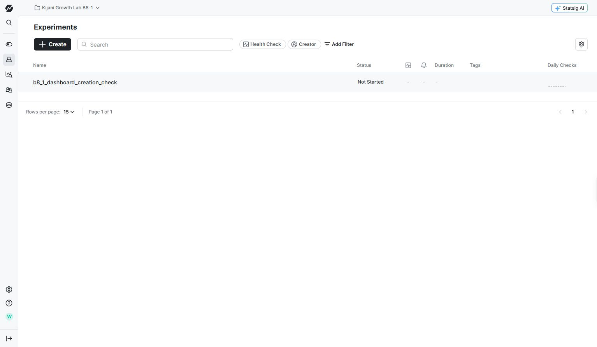
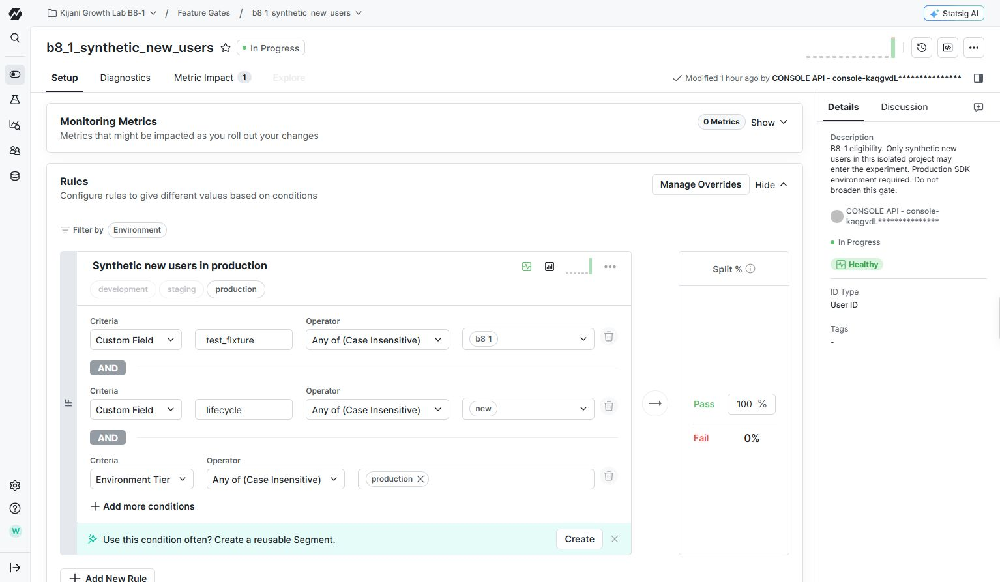
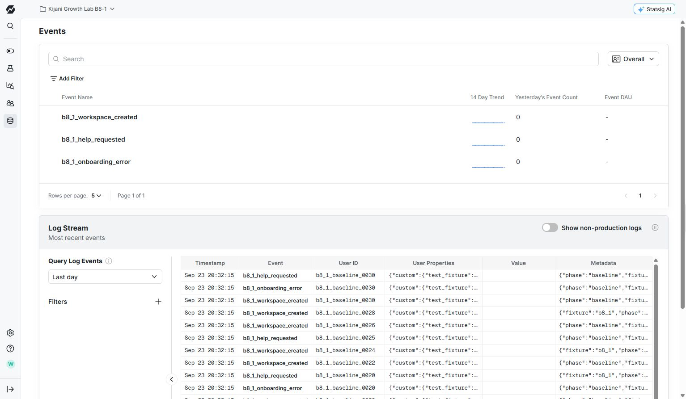

# B8-1 source materials and before state

Prepared September 23, 2026 for the Statsig Desktop connector test. Kijani is a fictional team-planning product. The hypothesis is that a three-step checklist helps new users create their first workspace without increasing onboarding errors or requests for help. All users and events in this pack are synthetic.

## Project and current starting state

[Kijani Growth Lab B8-1](https://console.statsig.com/H7zq0iHv0scPEXRMGF1C3/home), project ID H7zq0iHv0scPEXRMGF1C3. Live Statsig links require project access; this public pack provides screenshots and field-level exports for independent review without access to credentials.

The scored target b8_1_guided_onboarding does not exist. The project has one separate experiment, b8_1_dashboard_creation_check, in setup / Not Started status. It was created during a Chrome dashboard diagnostic, has not been launched and must be excluded from the scored run. Its default setup shows 100% allocation, but that is an unstarted configuration, not live traffic.

## Eligibility

[b8_1_synthetic_new_users](https://console.statsig.com/H7zq0iHv0scPEXRMGF1C3/gates/b8_1_synthetic_new_users) is enabled. Its passing rule requires test_fixture=b8_1, lifecycle=new and environment production; other users fail. The rule passes 100% of eligible users so the experiment can separately allocate 5% of that cohort. Baseline SDK checks admitted 30 eligible users and rejected two ineligible production users and one staging user.

## Metric definitions

The three intended metrics use event_user, User ID and One-Time Event rollup. Use these user-based definitions, not the automatically generated event-count metrics. The future experiment supplies the exposed-user population for comparison; raw baseline event totals are not experiment conversion rates.

- [Primary: b8_1_workspace_activation](https://console.statsig.com/H7zq0iHv0scPEXRMGF1C3/metrics/metrics_catalog/b8_1_workspace_activation/event_user/setup), sourced from b8_1_workspace_created; increase desired. [Definition screenshot](B8-1_Run1_Statsig_InputData_PrimaryMetric_03.png).
- [Guardrail: b8_1_onboarding_error_rate](https://console.statsig.com/H7zq0iHv0scPEXRMGF1C3/metrics/metrics_catalog/b8_1_onboarding_error_rate/event_user/setup), sourced from b8_1_onboarding_error; decrease desired. [Definition screenshot](B8-1_Run1_Statsig_InputData_ErrorGuardrail_04.png).
- [Guardrail: b8_1_help_request_rate](https://console.statsig.com/H7zq0iHv0scPEXRMGF1C3/metrics/metrics_catalog/b8_1_help_request_rate/event_user/setup), sourced from b8_1_help_requested; decrease desired. [Definition screenshot](B8-1_Run1_Statsig_InputData_HelpGuardrail_05.png).

Metric preview panels currently say they cannot generate a preview. This is recorded in the screenshots. The event stream and definition exports provide the source evidence; a metric chart alone is not proof that the experiment works.

## Received baseline events

[Statsig Events](https://console.statsig.com/H7zq0iHv0scPEXRMGF1C3/metrics/events) contains 24 baseline rows: 15 workspace-created events, three onboarding errors and six help requests, received September 23 at 20:32:15 EAT (17:32:15 UTC). The fresh stream check returned 24 data rows. These establish SDK event ingestion before the run. They are not experiment exposure events, and no launch result can be inferred from them. Some metric sample views display the UTC clock without a timezone label; the saved SDK timestamp is explicitly UTC.

- [All 24 received rows as CSV](B8-1_Run1_Statsig_InputData_ReceivedEvents.csv)
- [Baseline SDK checks and submitted counts](B8-1_Run1_Statsig_InputData_BaselineSDK.json)
- [Gate export](B8-1_Run1_Statsig_InputData_gates.json)
- [Metric catalog export](B8-1_Run1_Statsig_InputData_metrics.json)
- [Current experiment export](B8-1_Run1_Statsig_InputData_experiments.json)

The JSON snapshots were read through the Console API during preparation. They document inputs and do not establish connector capability. Masked key identifiers in exports have been replaced; no credentials are distributed.

## Connector access findings

The named statsig-kijani MCP connection reached the correct project but refused experiment creation with: "MCP tool Create_Experiment is unavailable because this user has read-only MCP access." The separate Statsig plugin exposed in the preparation chat returned the different project mico1 connectors, ID 2OZ8YjwbrfFIWk2bSRhu03, despite reporting write permissions. No writes were made there. The model must verify its actual project before writing. These findings are preparation evidence, not the result of the scored run. Existing preflight records remain in the repository's evidence/Run1-before directory.

## What the scored run should establish

Use the [prompt and expected result](../TEST-PROMPT.md). Full completion requires connector creation and launch, attached metrics, verified 5% allocation and received exposure evidence for both groups. Use the prepared SDK helper only after launch to generate traffic. A read-only error, a different project, a draft-only experiment or unverified ingestion must be reported accurately and cannot be presented as a completed launch. Do not use browser or direct API writes to finish blocked connector steps.

For Agora, these six screenshots plus the CSV and configuration exports document the input state. A ZIP is provided to keep the file count manageable. Add the actual prompt, connector activity, final output and post-run state separately after testing. This pack contains no scored output or after-state evidence.
